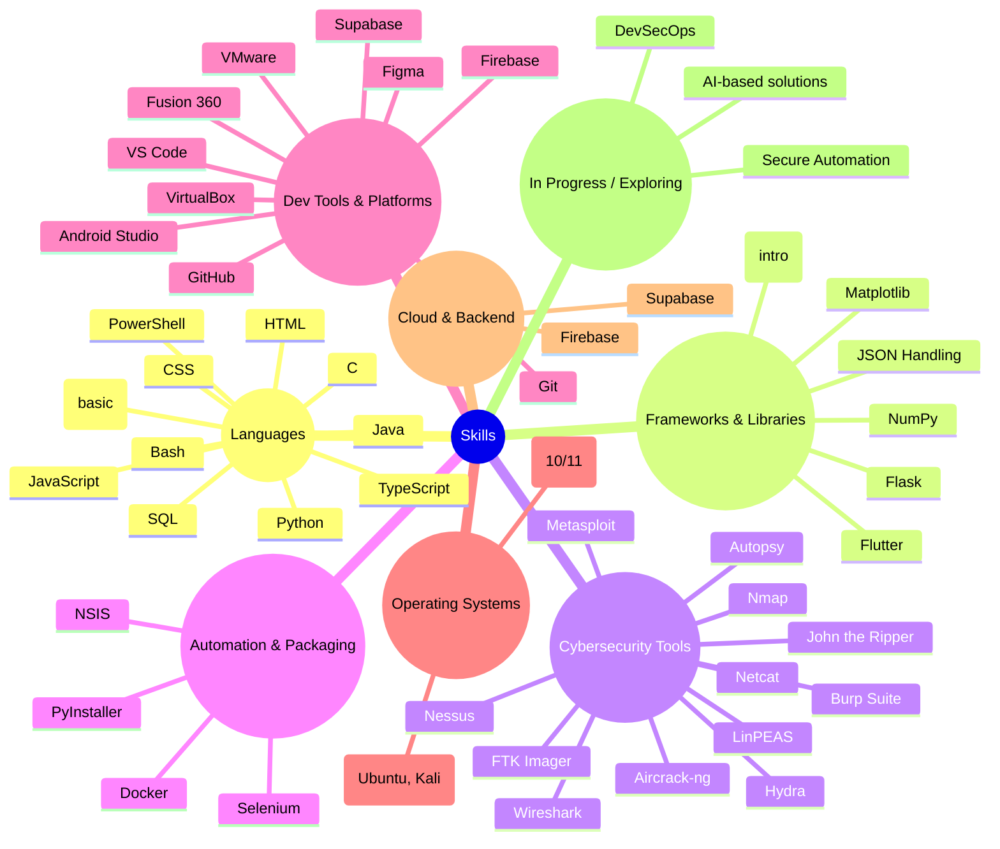

### Hello there ~ 
# Hi, I'm Jayanth Tatineni
### Developer | Cybersecurity Engineer | Exploring AI

⚡Stats and Skills

 

<!--
 
 
-->

  
  

<!--
 
  
 
-->

### 🛠️ Tech Snapshot

## 🏆 GitHub Trophies

<!--

  
  

-->

### 🤝 Connect with Me  
[Portfolio](https://jayanth-tatineni.netlify.app) · [LinkedIn](https://www.linkedin.com/in/jayanth-tatineni/) · **jayanthtatineni@gmail.com**

Let’s build something valuable.
